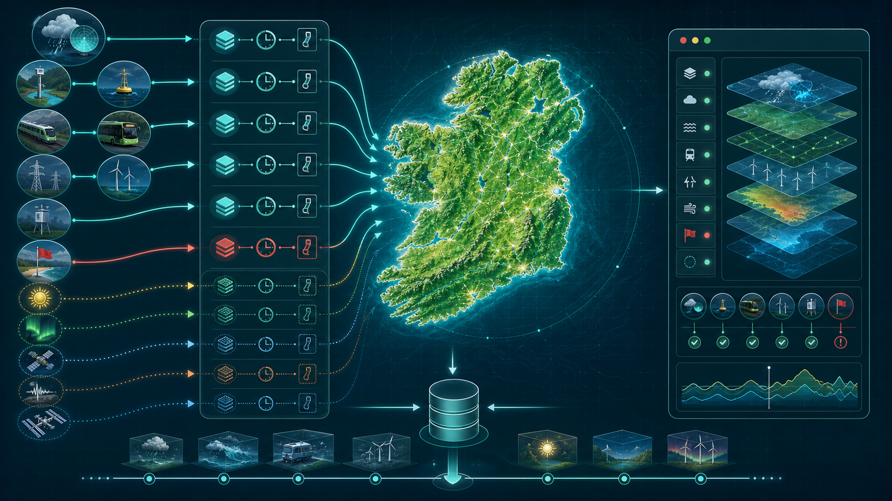
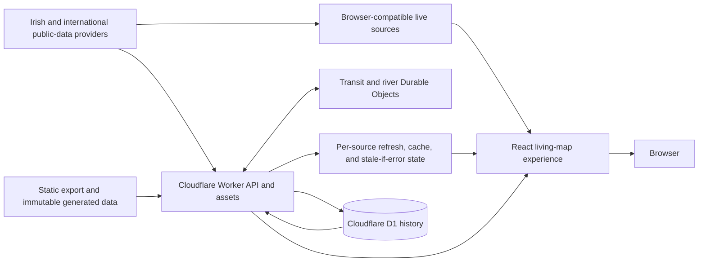

# A Day in Ireland architecture

Last reviewed: 2026-08-15

A Day in Ireland is a living public-data atlas. It combines observations, warnings, forecasts, models, calculated context, transport movement, imagery, and history while preserving source provenance, observation time, freshness, partial coverage, and unavailable states.

The infographic shows the product concept. The source and runtime details below define the implemented architecture.

## What the product does

The experience answers a broad question: what is happening across Ireland now, and how confidently can each observation be interpreted?

It presents:

- weather observations, warnings, radar, national forecast, and weather timeline
- rivers, marine observations, tide context, bathing-water advisories, and satellite imagery
- electricity demand, generation, wind, carbon, frequency, and interconnection context
- monitored and modeled air-quality data with the distinction preserved
- aurora, solar and lunar events, ISS passes, and recent earthquakes
- Irish Rail positions and NTA public-transport vehicle positions
- schedule-derived destinations kept separate from live vehicle positions
- source freshness, provenance, partial and stale states, history, shared views, and accessible map controls

The atlas supports situational awareness. Official sources remain authoritative for safety, transport, weather, and emergency decisions.

## System context

## Runtime layers

| Layer | Responsibility | Primary source |
| --- | --- | --- |
| Static frontend | Next.js static export, page metadata, manifest, informational pages, map assets, and generated transit dictionary | `app/`, `components/`, `public/` |
| Browser data client | Refreshes browser-compatible weather and monitored-air sources, merges responses, retains valid last-good evidence, enriches transit destinations, and handles offline state | `lib/browser-live.ts`, `lib/live-data.ts`, `lib/data-state.ts` |
| Experience model | Controls layers, place context, map projections, selections, movement clustering, history mode, accessibility, and presentation semantics | `components/IrelandExperience.tsx`, `components/experience-model.ts` |
| Cloudflare Worker | Serves static assets and API routes, enforces method boundaries, merges provider results, dispatches history, and handles scheduled capture | `platform/cloudflare-entry.js`, `platform/server-entry.js` |
| Source adapters | Normalize bounded provider payloads into typed internal evidence | `platform/history-sources.js`, `platform/live-normalize.js`, `platform/sky-source.js`, `platform/river-source.js` |
| NTA coordinator | Globally coalesces credentialed GTFS-Realtime vehicle refreshes and protects the provider token budget | Durable Object `NtaFeedCoordinator` |
| River coordinator | Coordinates direct OPW retrieval and Cloudflare Browser Rendering fallback | Durable Object `RiverFeedCoordinator` |
| History store | Writes compact snapshots and summaries and reads historical ranges | `platform/history-store.js`, `platform/history.js`, D1 `HISTORY_DB` |
| Build pipeline | Generates static export, source provenance, content-hashed transit data, hash-based inline script CSP, and performance-budget checks | `scripts/` |

## Live data flow

1. The Worker serves the static application and an initial snapshot.
2. The browser establishes independent weather, living, context, transit, and history states rather than relying on one all-or-nothing response.
3. Browser-compatible providers can refresh directly from the browser. Worker-only or coordinated providers are requested through `/api/*`.
4. Each source receives its own TTL, deterministic jitter, in-flight coalescing, retry state, circuit backoff, stale-if-error handling, generation ordering, and provenance.
5. A partial source does not clear healthy unrelated layers. Last-good evidence remains visible only within source-specific freshness rules.
6. NTA vehicle requests go through the global Durable Object coordinator. Without `NTA_API_KEY`, the API reports `credential-required` and does not invent positions.
7. Transit destinations are loaded lazily from a small manifest and immutable content-hashed GTFS dictionary only when live trips need schedule metadata.
8. OPW river data uses direct retrieval where possible. The production Cloudflare adapter can use Browser Rendering as a coordinated fallback when the origin rejects normal Worker requests.
9. The map renders observations, models, forecasts, calculations, stale values, and unavailable values with separate presentation semantics.

## History flow

1. A Cloudflare Cron Trigger runs every 15 minutes.
2. The Worker gathers bounded current evidence and compact aggregates.
3. Exact retention rules decide which sources can store positions, summaries, or only a gap explanation.
4. D1 stores versioned history snapshots, provenance, gaps, and daily summaries.
5. `/api/history` and `/api/history/range` retrieve bounded views for the timeline and past-map experience.
6. Sources without retained historical detail remain explicitly unavailable in history mode.

## Public interfaces

| Interface | Purpose |
| --- | --- |
| `GET /api/health` | Cheap runtime, binding liveness, and deployed-build provenance read from the served assets; no provider fan-out |
| `GET /api/living` | Current rail and river evidence with provenance |
| `GET /api/contexts` | Weather, water, energy, air, bathing, earth, sky, and related context |
| `GET /api/transit` | Coordinated NTA live vehicle positions |
| `GET /api/history` | Historical snapshot lookup |
| `GET /api/history/range` | Bounded history range and summary retrieval |
| `/data/transit-destinations.manifest.json` | Transit dictionary provenance and content-hashed asset pointer |

Public data APIs accept `GET` and `HEAD`; unsupported methods return `405`. `OPTIONS` receives a minimal response where supported.

## Third-party data services

| Provider | Data used | Access path | Required |
| --- | --- | --- | --- |
| Met Éireann | Station observations, fallback observation download, warnings, radar metadata and tiles, national text forecast | Browser and Worker HTTPS | Core weather layers |
| Marine Institute ERDDAP | Offshore buoys, coastal observations, tide gauges, predicted tides, and marine guidance | Worker HTTPS | Marine layers |
| Iarnród Éireann | Current train positions | Browser or Worker HTTPS | Rail layer |
| Office of Public Works `waterlevel.ie` | Near-real-time river gauges | Direct HTTPS plus coordinated Browser Rendering fallback | River layer |
| EirGrid Smart Grid Dashboard | All-island demand, generation, wind, carbon, frequency, and interconnection data | Worker HTTPS | Energy layer |
| European Environment Agency | Up-to-date monitored air-quality station data | Browser HTTPS | Measured-air layer |
| Open-Meteo Air Quality API | CAMS regional model fields | Worker HTTPS | Modeled-air layer |
| Environmental Protection Agency Ireland | Bathing-water locations, restrictions, and advisories | Worker HTTPS | Bathing layer |
| National Transport Authority | GTFS-Realtime vehicle positions and offline GTFS timetable data | Worker HTTPS with encrypted `NTA_API_KEY`; generated static dictionary | Transit layer |
| Sunrise-Sunset.org | Sunrise, twilight, golden hour, blue hour, solar position, and lunar events | Worker HTTPS | Sky context |
| NOAA Space Weather Prediction Center | OVATION aurora probability and planetary K-index | Worker HTTPS | Aurora layer |
| NASA GIBS | VIIRS near-real-time true-colour imagery and tiles | Worker metadata plus browser tile requests | Satellite layer |
| USGS Earthquake Hazards Program | Recent detected earthquakes around Ireland | Worker HTTPS | Earthquake layer |
| CelesTrak | ISS two-line orbital elements | Worker HTTPS | ISS calculations |

## Platform and library dependencies

| Platform or library | Role |
| --- | --- |
| Cloudflare Workers and Assets | Production API, routing, static application, cache behavior, Cron, and observability |
| Cloudflare Durable Objects | Single logical coordinators for NTA and OPW refreshes |
| Cloudflare D1 | Historical snapshots and summaries |
| Cloudflare Browser Rendering | Temporary OPW retrieval fallback in the production Cloudflare adapter |
| Next.js and React | Static application structure and interactive UI |
| `d3-geo` | Ireland map projection and geographic calculations |
| `satellite.js` | Local ISS orbit propagation and pass calculations |

The non-Cloudflare server adapter supports an operator-configured river bridge fallback (`RIVER_BRIDGE_URL`, HTTPS only; the bridge is disabled unless the URL is explicitly provided). Production on `day.illek.ie` uses the Cloudflare adapter and Browser Rendering path. A configured bridge is an alternate-adapter dependency and is not an origin of truth.

## Internal data contract

Every source result carries enough context to avoid collapsing missing information into zero:

- source status such as live, partial, stale, fallback, credential-required, or unavailable
- latest observation and successful refresh timestamps
- provider identity and source URL where appropriate
- distinction between measurement, model, forecast, timetable metadata, and local calculation
- bounded item counts, freshness rules, and explicit gaps

Presentation helpers turn that typed evidence into user-facing language without changing the underlying semantics.

## Storage, privacy, and security boundaries

- Most live provider data is requested, normalized, cached briefly, and displayed without user accounts.
- D1 contains public-data history and aggregate summaries rather than user profiles.
- Shared-view state is encoded in the application URL or local browser state.
- Browser local storage holds selected local experience state.
- The NTA key is stored as an encrypted Cloudflare secret and never exposed to the browser or committed configuration.
- External providers receive normal requests for their public data. User identity and behavioural profiles are not part of the application data model.

## Reliability and failure model

- Source refreshes are independent and use per-source TTL, jitter, coalescing, backoff, and stale-if-error rules.
- An unavailable provider does not clear healthy unrelated data.
- Out-of-order observations do not overwrite newer state.
- Old positions and measurements expire according to source-specific limits.
- Partial context snapshots remain cacheable when at least one source is usable.
- All-unavailable responses use no-store caching.
- Health checks do not fan out to providers.
- Generated transit data is immutable and addressed by content hash.

## Deployment topology

Production uses one Worker custom domain at `day.illek.ie`. The Worker serves `dist/client`, routes APIs, binds `HISTORY_DB`, `NTA_FEED`, `RIVER_FEED`, and `BROWSER`, and runs the history Cron every 15 minutes. The configuration allows 1,000 ms CPU and 100 subrequests. `workers.dev`, preview URLs, and Pages are disabled.

## Non-goals

The product does not replace official warnings, emergency services, transport operators, route planners, flood forecasts, air-quality authorities, or marine safety services. It does not guarantee delays, route safety, bathing safety, flood risk, or future conditions.

## Verification map

- Unit and data-trust tests: `npm test`
- Type and lint checks: `npx tsc --noEmit`, `npm run lint`
- Browser and accessibility tests: `npm run test:e2e`
- Static build: `npm run build`
- Asset and request budgets: `npm run check:budgets`
- Release provenance gate: `npm run check:release`
- D1 schema: `migrations/0001_history_v1.sql`
