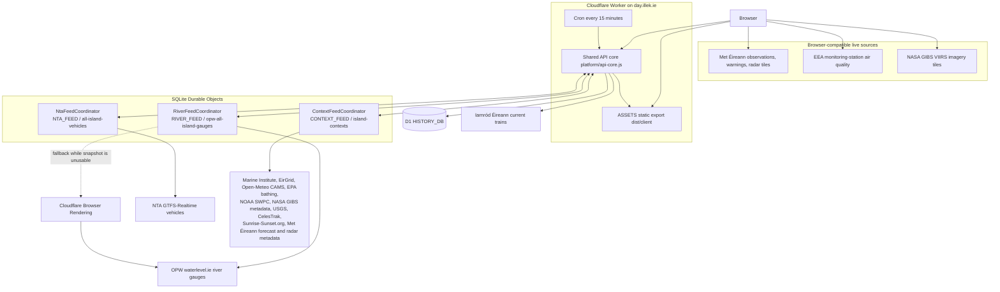

# A Day in Ireland 2.0

A daily, near-real-time portrait of weather, water, energy and movement across Ireland.


Live at [day.illek.ie](https://day.illek.ie). The image above is the checked-in Open Graph living-map visual, not a captured UI screenshot.

- [Experience](#experience)
- [Architecture](#architecture)
- [Data](#data)
- [Cloudflare deployment](#cloudflare-deployment)
- [Development](#development)
- [Experience and operations](#experience-and-operations)

## Experience

The atlas answers what is happening across Ireland now, and how confidently each observation can be interpreted. Official sources remain authoritative for safety, transport, weather and emergency decisions.


The infographic is the product-concept diagram already used in [ARCHITECTURE.md](ARCHITECTURE.md): sources, freshness, history and layered map presentation. Runtime topology is the mermaid below, not this illustration.

See [ARCHITECTURE.md](ARCHITECTURE.md) for the frontend, Worker, Durable Object, history, source coordination, data-flow and third-party provider architecture. See [September experience changes](docs/experience-review.md) for the daily briefing, town directory, history decisions and the `/v2` living atlas.

## Architecture

Production is one Cloudflare Worker custom domain at `day.illek.ie`. The Worker serves the static export, routes `/api/*`, and binds three SQLite Durable Object coordinators, D1 history, Browser Rendering and version metadata. Browsers also fetch a few compatible providers directly so those payloads never fan out through the Worker.



Bindings and request paths match `wrangler.api.toml` and [ARCHITECTURE.md](ARCHITECTURE.md):

| Binding | Role |
| --- | --- |
| `ASSETS` | Next.js static export in `dist/client`, including content-hashed generated data |
| `NTA_FEED` | Global NTA GTFS-Realtime coordinator; 65-second refresh floor for the provider token budget |
| `RIVER_FEED` | Global OPW coordinator; direct HTTPS first, Browser Rendering only as a temporary fetch path |
| `CONTEXT_FEED` | Shared `/api/contexts` snapshot; optional `sources` filters apply before upstream refresh |
| `HISTORY_DB` | Compact 15-minute snapshots, hourly rollups and daily summaries |
| `BROWSER` | Coordinated OPW fallback when `waterlevel.ie` rejects ordinary Worker HTTPS |
| `CF_VERSION_METADATA` | Deployed Worker version id on `/api/health` |

Without `NTA_API_KEY`, `/api/transit` reports `credential-required` and never invents positions. River provenance distinguishes direct OPW data, Browser Rendering fallback, a configured `RIVER_BRIDGE_URL` bridge on the non-Cloudflare adapter only, cached stale data, and an unavailable source. Browser Rendering is not a second origin of truth.

Both hosting adapters share one Worker API core (`platform/api-core.js`): provider acquisition, the context refresh state machine, cache tiers, error contracts and API dispatch are defined exactly once.

## Data

- Met Éireann observations, warnings and five-minute rainfall-radar tiles, licensed under CC BY 4.0.
- Marine Institute offshore weather buoys, coastal observatories, real-time tide gauges, predicted high/low water and storm-surge guidance, licensed under CC BY 4.0.
- Iarnród Éireann current train positions.
- OPW near-real-time river gauges, licensed under CC BY 4.0.
- EirGrid all-island operational demand, generation, wind, carbon, frequency and interconnection data.
- EEA up-to-date monitoring-station air quality, alongside Open-Meteo fields derived from the CAMS regional model. Measurements and model estimates are explicitly distinguished.
- NOAA SWPC OVATION aurora probability and planetary K-index guidance.
- EPA active bathing-water restrictions and advisories, licensed under CC BY 4.0.
- NASA GIBS VIIRS near-real-time true-colour imagery.
- USGS detected earthquakes from the previous seven days around Ireland.
- CelesTrak ISS orbital elements, with 48-hour passes calculated locally for central Ireland.
- NTA GTFS-Realtime vehicle positions when an `NTA_API_KEY` production environment variable is configured. NTA GTFS timetable data used for the destination dictionary is licensed under CC BY 4.0, provided “as is”; the NTA is not responsible for errors or inaccuracies.
- Sunrise-Sunset.org API v2 sunrise, twilight, golden/blue-hour, solar-position and lunar events for the Ireland centre point, with visible attribution. The Worker fetches a short Dublin-date window, not a whole calendar year.
- Met Éireann live national text forecast, shown verbatim with the current official warnings feed.
- OpenStreetMap road and island-boundary geometry, © OpenStreetMap contributors, ODbL.
- GeoNames populated places for the town directory, licensed under CC BY 4.0.

Weather, radar and the additional island contexts refresh every five minutes; train positions refresh every minute. OPW normally publishes river levels about every fifteen minutes, and deployed readings automatically expire after three hours if an upstream refresh is unavailable. Marine observations expire after six hours. Missing or stale values are not represented as zero.

The NTA integration is credential-aware: without `NTA_API_KEY`, the UI explains that developer access is required and never substitutes scheduled or historical positions. Create a free key at [developer.nationaltransport.ie](https://developer.nationaltransport.ie/), then store it as an encrypted deployment secret.

The checked-in transit destination dictionary is a legacy generated artifact: `feedVersion` and `archiveSha256` in `public/data/transit-destinations.manifest.json` are null until rebuilt. Rebuild from a dated NTA GTFS archive with:

```bash
NTA_API_KEY=… npm run refresh:transit
# or
NTA_GTFS_ARCHIVE=/path/to/gtfs.zip npm run refresh:transit
```

The same `NTA_API_KEY` Wrangler secret used for live vehicles is required; this repository does not commit it.

## Cloudflare deployment

The Cloudflare production architecture uses:

- A static export in `dist/client`, served through the Worker asset binding.
- A Worker custom domain on `day.illek.ie` that serves the API and static assets. Development and preview hostnames remain disabled.
- A SQLite-backed Durable Object as the single global NTA refresh coordinator.
- A SQLite-backed Durable Object as the shared `/api/contexts` snapshot, so browsers do not fan out independently. Optional `sources` filters are applied before upstream refresh, and expensive misses are rate-limited per IP.
- `/api/health` reports Cloudflare's Worker version id (`CF_VERSION_METADATA.id`) as `build.deploymentId` when deployed.
- A 65-second upstream refresh floor and 60-second edge response cache, satisfying the NTA token limit across Cloudflare locations.
- Independent weather, living and context state merges plus two-attempt browser refreshes prevent a single slow upstream from clearing unrelated healthy layers. Failed providers are marked unavailable instead of being kept live by a stale whole-response cache.
- Browser-side EEA monitoring-station retrieval, keeping heavy CSV processing outside the Worker context endpoint.
- Direct OPW river retrieval where supported, with a globally coordinated 15-minute Cloudflare Browser Run fallback because `waterlevel.ie` currently rejects ordinary Cloudflare Worker HTTPS requests with a contradictory-scheme proxy error. Treat Browser Run as a temporary fetch path, not a second origin of truth. The coordinator skips Browser Rendering while a usable snapshot remains, so a blocked origin cannot burn a session every refresh.
- The non-Cloudflare server adapter supports an operator-configured river bridge for that same OPW fallback (`RIVER_BRIDGE_URL`, HTTPS only, disabled unless set); treat any such bridge as an operational dependency rather than an origin of truth for the data.

The checked-in Worker candidate is configured for Workers Paid, with one direct `*/15` history Cron and a 1,000 ms CPU ceiling. This describes the local deployment configuration only; it does not imply that the candidate has been deployed. Requests on the custom hostname pass through the Worker, while content-hashed generated data assets are cached for a year at the edge; HTML documents carry no explicit edge caching rule.

The Worker serves the exported frontend directly from its static asset binding on `day.illek.ie`.

`/api/health` reports the deployed build's provenance (commit, build time, config and data hashes, and Cloudflare version id) by reading `build-provenance.json` plus the `CF_VERSION_METADATA` binding. Missing or unreadable provenance degrades to `unknown`; it never fails the endpoint.

The build generates a per-page script CSP: after the static export lands in `dist/client`, `scripts/write-csp-headers.mjs` removes the global template policy and gives each document a `Content-Security-Policy` whose `script-src` lists sha256 hashes of only that page's inline scripts (one policy per document, because Cloudflare's `_headers` format caps line length). `public/_headers` stays valid on its own if that step is skipped.

The API surface is self-describing: `/api/openapi.json` serves an OpenAPI 3.1 document, and the human-readable contract lives on the `/developers` page. There is no MCP transport.

Decorative road geometry is not part of the JavaScript bundle or the pre-rendered HTML. The map fetches `/map/major-roads.json` once after mount; the URL carries a content-hash version query computed at configure time, and the asset is cached immutably.

The `/api/living` response includes `sourceStatus` and `sourceProvenance` for rail and river feeds.

```bash
npm run build
npm run deploy:cloudflare:api
npx wrangler secret put NTA_API_KEY --config wrangler.api.toml
npm run deploy:cloudflare
npm run check:deployment
```

Run `npm run check:deployment` after an authorised production deployment. The read-only check fails unless `day.illek.ie` reports the current commit, Worker configuration hash, and transit-data hash. It also checks the hash-based script CSP and the branded 404 response. Pass another HTTPS origin and expected commit only when verifying a staged candidate: `npm run check:deployment -- https://staging.example.ie <commit>`.

Never place the NTA key in `wrangler.api.toml` `[vars]`, `.dev.vars` committed to git, `.env`, or source control. For local Worker runs, copy `.dev.vars.example` to `.dev.vars`. For production, use `wrangler secret put` so Cloudflare stores the encrypted secret.

## Development

```bash
npm install
npm run dev
npm test
npm run test:e2e
npm run build
npm run check:html
npm run check:budgets
```

## Experience and operations

See [September experience changes](docs/experience-review.md) for the daily briefing, town directory and history decisions. Use [the operations guide](docs/production/operations.md) for read-only provider and capture checks.

## License

MIT © Koya Illek. See [LICENSE](LICENSE).

Live service: [day.illek.ie](https://day.illek.ie).
